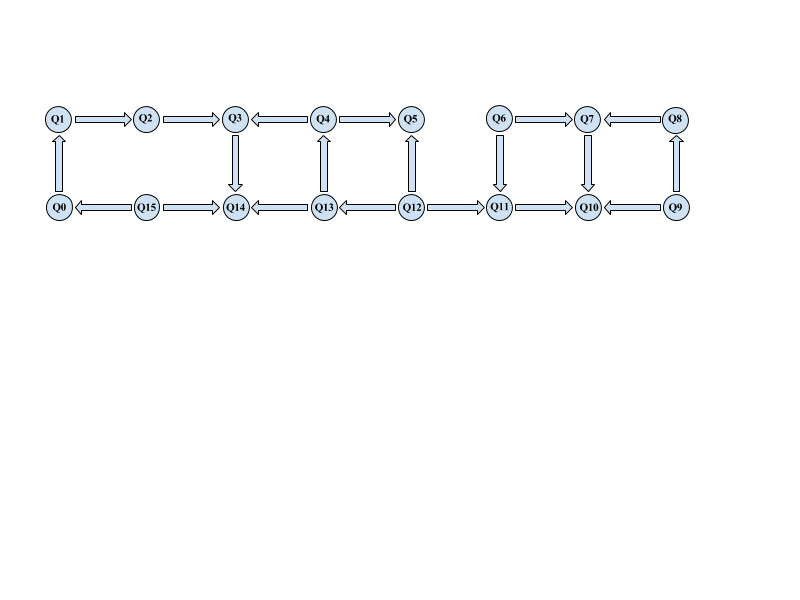
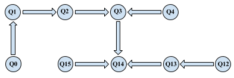
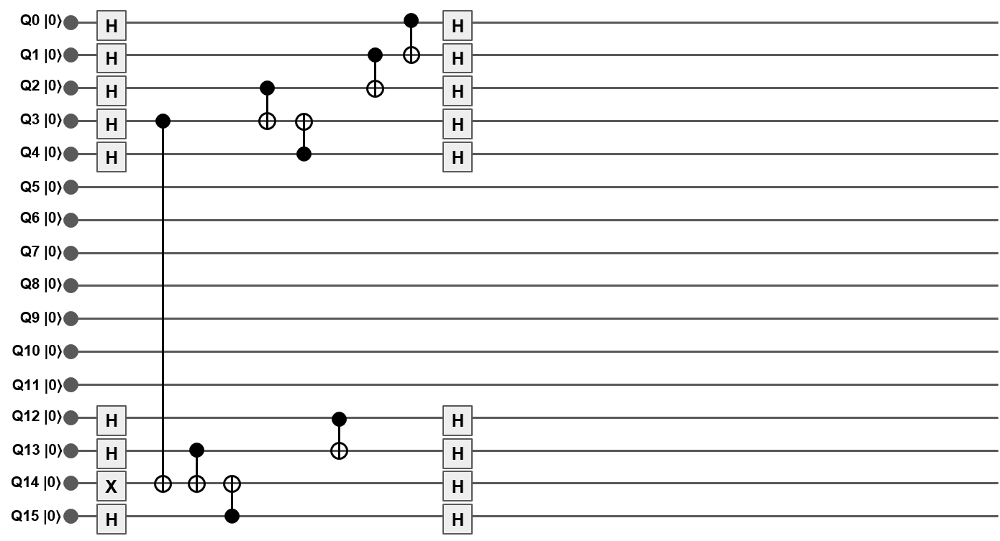

# ibmqx_envariance
The purpose of this project is to demonstrate entanglement-assisted invariance, aka _envariance_, using the existing (and perhaps future) _ibmqx_ series quantum computers.

## Structure
The [_utility.py_](Envariance/utility.py) is a collection of functions that, given the coupling-map and the number of qubits, will find the most connected qubit in the map and create around it the quantum circuit needed for the demonstartion.
In [_envariance.py_](Envariance/envariance.py) yuo can use the _launch_exp_ function to run a circuit, using _utility.create(...)_, on a specified back-end device, with the specified number of shots and qubits; the result of the execution will be written in a _txt file_ and a _xlsx_ file for further use.

### What it does

Lets say we want to demonstrate envariance for a system of 9 qubits on ibmqx3 (9 is the maximum number of qubits that you wiil be able to use on ibmqx3 for this experiment); utility.py will find that the most connected qubit is _Q14_ and , starting from that, will create the crresponding circuit.

_ibmqx3 coupling-map_:
# 

_coupling-map in python_:
```python
coupling_map_16 = {
    0: [1],
    1: [2],    2: [3],
    3: [14],
    4: [3, 5],
    5: [],
    6: [7, 11],
    7: [10],
    8: [7],
    9: [8, 10],
    10: [],
    11: [10],
    12: [5, 11, 13],
    13: [4, 14],
    14: [],
    15: [0, 14],
}
```

Below the portion of the coupling-map selected by utility.py:
# 
The resulting circuit:
# 

## Example
You can find an exaustive example in [_example.py_](Envariance/example.py), where you will run the experiment on both ibmqx2 and ibmqx3 while changing the number of qubits and shots (be aware that you will need at least 5 credits on your IBM Quantum Experience account to run it).
