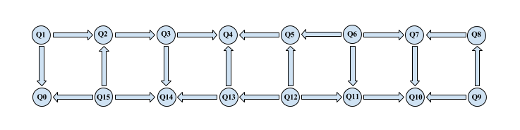
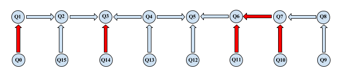

# IBMQX Experiments
The purpose of this repository is to demonstrate entanglement assisted invariance,
also known as envariance, and parity learning,
using IBM QX series quantum computers.

Here you will find not only the code needed to run the experiments yourself,
but also the results of ours
(in case you don't have the time or patience and just want to see the data).

## Requirements

In order to run the experiments or just work with this repository you'll need to setup
the QISKit sdk, detailed instructions cn be found
[here](https://github.com/QISKit/qiskit-sdk-py/blob/master/doc/install.rst#3.1-Setup-the-environment).

You'll also need to register on [IBM Quantum Experience](https://quantumexperience.ng.bluemix.net/qx/community)
in order to receive your API Token (a key to grant you access to IBM QX quantum computers)
and have at least 5 credits on that account.

## Utility

[utility.py](https://github.com/DavideFrr/ibmqx_experiments/blob/master/utility.py)
contains all the functions needed to find the most connected qubit, given coupling-map,
and than proceed to create the circuits for envariance demonstration and parity learning respectivly.

As already mentioned, the core of the problem is to find the qubit that is most connected;
by most connected we mean that it can be connected (directly or not) by means of cnot gates
to as many other qubits as possible.

The algorithm starts from a source node and explores the paths that goes from there,
every time a new node is reached, it’s added to the list of visited ones from the previously
mentioned source node and a counter for the visited node is incremented by one. If during
the exploration of the paths exiting from the current source node an already visited node
is reached, the algorithm ignores it and goes back to the previous one (if we have already
visited that ode starting from the current source, than every path that goes from it has
already been explored or is going to be).

All of the above is done by the explore() method which is called by the ranking() method,
whose objective is to assign a rank (the counter incremented when a node is reached) to
every node based on how many nodes can reach it. The node with the higher rank will be
selected as the start point for building our circuit.

After the most connected node/qubit has been found, the create_path() method explores
the map backwards and first connects all the qubits for which a classic CNOT gate is feasible.
Then, it starts connecting the other qubits with inverse-CNOT gates.
In this way, we can keep the number of gates to a minimum, assuming that every gate
we add to the circuit brings a certain amount of error with it.


_ibmqx5 coupling-map graphic rapresentation_:
# 

_coupling-map python rapresentation_:
```python
coupling_map_qx5 = {
    0: [],
    1: [0, 2],
    2: [3],
    3: [4, 14],
    4: [],
    5: [4],
    6: [5, 7, 11],
    7: [10],
    8: [7],
    9: [8, 10],
    10: [],
    11: [10],
    12: [5, 11, 13],
    13: [4, 14],
    14: [],
    15: [0, 2, 14],
}
```


Below the portion of the coupling-map selected by utility.py:
# 
_Red arrows means the use of inverse cnot_

## Envariance

... ...

## Parity

... ...
